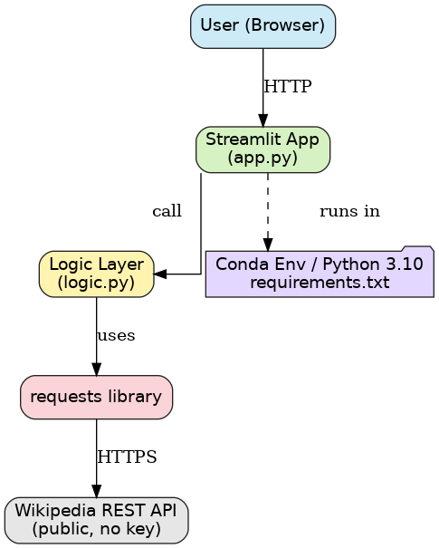
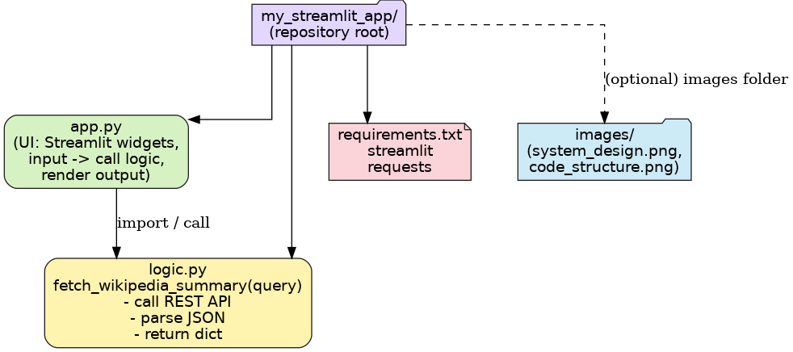

# streamlit-exmaple-kadai
# 📚 Wikipedia Summarizer

## アプリ概要
このアプリは、ユーザーが入力したキーワードを Wikipedia API に問い合わせて、その要約を表示するシンプルなアプリです。  
Streamlit を使って作成しており、Webブラウザから操作できます。

## 使用しているAPI
- Wikipedia REST API  
  - 公式ドキュメント: https://en.wikipedia.org/api/rest_v1/

## システム設計図
  

## コード説明図
  

